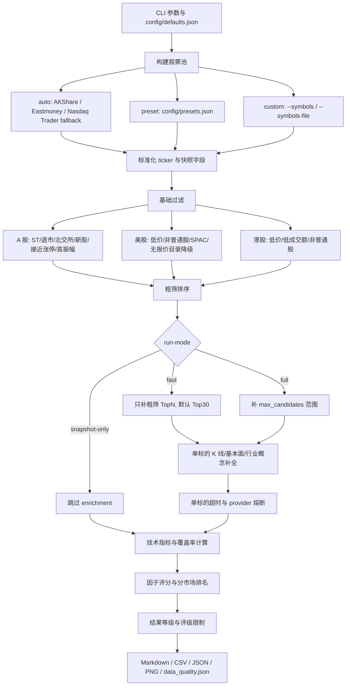

# Multi-Market Stock Picker

面向 A 股、美股、港股的本地化多市场选股研究工具。它会从公开行情源或自定义股票池获取候选标的，执行快照过滤、可选 K 线/基本面补全、因子评分和中文报告生成，最终输出 TopN 研究候选、CSV/JSON 数据和 PNG 图表。

> 本项目仅用于研究辅助，不构成投资建议、交易指令或收益承诺。

## 功能概览

- 支持市场：A 股、美股、港股，以及跨市场 `all`。
- 支持股票池：自动全市场快照、内置 preset、自定义 symbol、自动/预设与自定义组合。
- 支持三种运行模式：
  - `snapshot-only`：只用全市场快照快速初筛，不补历史 K 线和基本面。
  - `fast`：默认模式，只对粗筛 TopN 进行深度补全，默认 Top30。
  - `full`：对 `--max-candidates` 范围内候选执行完整补全。
- 稳定性增强：
  - 缓存按 TTL 生效，兼容旧缓存格式。
  - 单标的 enrichment 硬超时。
  - provider 连续失败后熔断，避免整轮卡死。
  - 外部数据源失败时仍尽量生成低覆盖率报告。
- 输出：
  - `screening_report.md`
  - `screening_results.csv`
  - `screening_results.json`
  - `top10_candidates.csv`
  - `score_distribution.png`
  - `top_candidates.png`
  - `data_quality.json`
- 跟踪与验证：
  - Watchlist 模式会记录候选变化并生成跟踪报告。
  - Backtest 模式会基于缓存历史 K 线验证评分模型。

## 快速开始

首次使用先创建 skill-local Python 环境并安装依赖：

```bash
python3 ~/.codex/skills/multi-market-stock-picker/scripts/run_stock_picker.py --setup
```

运行默认快速模式：

```bash
python3 ~/.codex/skills/multi-market-stock-picker/scripts/run_stock_picker.py \
  --market all \
  --universe auto \
  --style balanced \
  --top-n 10
```

A 股快照初筛：

```bash
python3 ~/.codex/skills/multi-market-stock-picker/scripts/run_stock_picker.py \
  --market a-share \
  --universe auto \
  --run-mode snapshot-only \
  --top-n 10
```

美股快速评分：

```bash
python3 ~/.codex/skills/multi-market-stock-picker/scripts/run_stock_picker.py \
  --market us \
  --universe auto \
  --run-mode fast \
  --top-n 10
```

自定义股票池：

```bash
python3 ~/.codex/skills/multi-market-stock-picker/scripts/run_stock_picker.py \
  --market all \
  --universe custom \
  --custom-mode only \
  --symbols AAPL,MSFT,0700.HK,600519.SS \
  --run-mode fast \
  --top-n 10
```

日常筛选并更新 Watchlist：

```bash
python3 ~/.codex/skills/multi-market-stock-picker/scripts/run_stock_picker.py \
  --market a-share \
  --universe auto \
  --run-mode fast \
  --top-n 10 \
  --watchlist \
  --watchlist-name a-share-fast
```

使用缓存 K 线跑回测验证：

```bash
python3 ~/.codex/skills/multi-market-stock-picker/scripts/run_stock_picker.py \
  --market us \
  --universe custom \
  --symbols AAPL,MSFT,NVDA \
  --backtest \
  --backtest-start 2025-01-01 \
  --backtest-end 2025-12-31 \
  --backtest-frequency weekly \
  --backtest-top-n 2
```

指定输出目录：

```bash
python3 ~/.codex/skills/multi-market-stock-picker/scripts/run_stock_picker.py \
  --market a-share \
  --universe auto \
  --out-dir ~/Desktop/stock-picker-output/manual-run
```

默认输出目录为桌面：

- macOS/Linux：`~/Desktop/stock-picker-output/<market>/<timestamp>/`
- Windows：`%USERPROFILE%\Desktop\stock-picker-output\<market>\<timestamp>\`

## 常用参数

| 参数 | 说明 |
|---|---|
| `--market` | `a-share`、`us`、`hk`、`all` |
| `--universe` | `auto`、`preset`、`custom`、`auto+custom`、`preset+custom` |
| `--custom-mode` | `only`、`append`、`intersect`、`exclude` |
| `--symbols` | 逗号分隔的 ticker，例如 `AAPL,MSFT,0700.HK,600519.SS` |
| `--symbols-file` | CSV/TXT 股票列表文件，CSV 可包含 `symbol,name,market` |
| `--style` | `balanced`、`momentum`、`quality-trend` |
| `--run-mode` | `snapshot-only`、`fast`、`full`，默认 `fast` |
| `--top-n` | 报告中展示的候选数量，默认 10 |
| `--max-candidates` | 粗筛后最多进入补全范围的候选数，默认 200 |
| `--no-cache` | 跳过本地缓存，强制重新请求数据源 |
| `--live` | 允许可选实时增强调用 |
| `--watchlist` | 启用候选跟踪，写入 watchlist 状态和变化报告 |
| `--watchlist-name` | Watchlist 命名空间，默认 `default` |
| `--watchlist-state-dir` | Watchlist 持久状态目录，默认桌面输出根目录下 `_state/watchlists` |
| `--watchlist-lookback-runs` | 连续缺席多少轮后移出观察池，默认 5 |
| `--backtest` | 启用缓存历史 K 线回测，不生成常规筛选报告 |
| `--backtest-start` / `--backtest-end` | 回测日期范围 |
| `--backtest-window-days` | 每个评估截面使用的历史窗口，默认 120 |
| `--backtest-hold-days` | 入选后观察期，默认 20 |
| `--backtest-frequency` | `daily`、`weekly`、`monthly`，默认 `weekly` |
| `--backtest-top-n` | 回测每期选出的 TopN，默认复用 `--top-n` |
| `--ai-narrative` | 使用 OpenAI-compatible API 生成候选叙述，需 `OPENAI_API_KEY` |

## 运行模式选择

| 模式 | 适用场景 | 行为 | 结果等级 |
|---|---|---|---|
| `snapshot-only` | 数据源不稳定、想快速看全市场活跃股 | 只用快照字段评分，不请求 K 线/基本面 | `快照初筛` 或 `低覆盖率结果` |
| `fast` | 日常默认筛选 | 先粗筛，再只补 TopN 深度数据，默认 Top30 | `快速评分` 或 `低覆盖率结果` |
| `full` | 更完整的研究候选生成 | 对 `--max-candidates` 范围内候选补 K 线/基本面 | `完整评分` 或 `低覆盖率结果` |

## 流程图



## 数据源与降级策略

| 市场 | 快照源 | 历史/基本面 | 降级策略 |
|---|---|---|---|
| A 股 | AKShare，失败后尝试 Eastmoney clist | Eastmoney K 线；快照中的 PE/PB/市值；AKShare 个股行业/概念 | K 线失败时保留快照评分，标记低覆盖率 |
| 美股 | AKShare，失败后使用 Nasdaq Trader Symbol Directory | yfinance 历史与基本面 | Nasdaq Trader 仅作为股票目录；无价格字段不得进入高置信结果 |
| 港股 | AKShare | yfinance 历史与基本面 | 字段缺失会降低覆盖率，不直接伪造数据 |

缓存写入 `.cache/`，新格式包含：

```json
{
  "fetched_at": "2026-07-05T00:00:00+00:00",
  "source": "provider-name",
  "payload": {}
}
```

TTL 默认配置在 `config/defaults.json`：

- `market_snapshots`: 6 小时
- `history`: 24 小时
- `fundamentals`: 72 小时

## 输出字段说明

核心结果文件为 `screening_results.csv` 和 `screening_results.json`。常用字段：

| 字段 | 说明 |
|---|---|
| `rank_global` | 跨市场研究排序 |
| `rank_in_market` | 市场内排序 |
| `market` | 市场 |
| `raw_symbol` / `yahoo_symbol` | 原始代码 / Yahoo-compatible ticker |
| `price` / `change_pct` / `turnover` | 快照价格、涨跌幅、成交额 |
| `pe` / `pb` / `market_cap` | 估值与市值字段 |
| `run_mode` | 本次运行模式 |
| `result_level` | `完整评分`、`快速评分`、`快照初筛`、`低覆盖率结果` |
| `industry` / `concepts` | 行业与概念字段，主要用于 A 股增强 |
| `enrichment_status` | `complete`、`partial`、`failed`、`timeout`、`skipped_snapshot_only`、`skipped_provider_breaker` |
| `final_score` | 综合评分，越高越好 |
| `data_coverage` / `quality_coverage` | 数据覆盖率 / 质量字段覆盖率 |
| `rating` | `重点跟踪`、`积极观察`、`需进一步验证`、`中性观察`、`暂不纳入` |
| `watch_status` | Watchlist 状态，例如 `新进入`、`继续跟踪`、`重点延续`、`降级观察`、`移出观察池` |
| `previous_rank` / `rank_change` | 上次排名与排名变化 |
| `previous_score` / `score_change` | 上次评分与评分变化 |
| `watch_runs` / `last_seen_at` | 连续跟踪次数与最近出现时间 |

`data_quality.json` 会记录：

- 数据源与数据源失败。
- 单标的失败。
- 缺失字段统计。
- 缓存使用与过期记录。
- provider 熔断记录。
- 本轮 `run_mode` 和 `result_level`。

## Watchlist 跟踪

启用 `--watchlist` 后，工具会读取并更新持久状态：

```text
~/Desktop/stock-picker-output/_state/watchlists/<watchlist-name>.json
```

每次运行额外输出：

- `watchlist_state.json`
- `watchlist_changes.csv`
- `watchlist_report.md`

状态含义：

- `新进入`：本次 TopN 首次出现。
- `继续跟踪`：仍在 TopN，评分和排名未明显恶化。
- `重点延续`：多次进入 TopN 且表现稳定。
- `降级观察`：跌出 TopN、评分明显下降、或结果等级变为低覆盖率。
- `移出观察池`：连续缺席达到阈值或评级转弱。

## Backtest 回测

启用 `--backtest` 后，本次运行不会生成常规筛选报告，而是生成模型验证产物：

- `backtest_report.md`
- `backtest_results.csv`
- `backtest_results.json`
- `backtest_quality.json`

V1 只使用 `.cache/history/` 中已有历史 K 线。缺少历史或历史窗口不足时，会写入 `backtest_quality.json`，不会补造数据。

核心指标包括：

- `period_count`
- `avg_forward_return`
- `median_forward_return`
- `win_rate`
- `max_drawdown`
- `avg_topn_score`
- `low_coverage_ratio`
- `industry_concentration`
- `market_breakdown`

## 注意事项

- 本工具不生成无条件买入/卖出指令，只输出研究候选。
- 公共行情源可能限流、超时或字段变更，尤其是 yfinance 和部分 AKShare/Eastmoney 接口。
- `snapshot-only` 适合快速初筛，不应被当成完整投研结论。
- `低覆盖率结果` 表示字段缺失较多，最高评级会限制为 `需进一步验证`。
- 美股 Nasdaq Trader fallback 只是股票目录，不包含实时价格、成交额、估值和历史 K 线。
- A 股接近涨停、高振幅、新股、ST/退市、北交所标的会被过滤或降级，以减少短线异常波动干扰。
- `--no-cache --live` 会显著增加外部请求压力；遇到限流时优先去掉 `--no-cache`，或降低候选数量。
- 如果本机存在失效代理环境变量，外部行情请求可能失败。可先检查：

```bash
env | rg -i 'proxy|no_proxy'
```

## 开发与验证

运行单元测试：

```bash
PYTHONPATH=~/.codex/skills/multi-market-stock-picker/scripts \
python3 -m unittest discover -s ~/.codex/skills/multi-market-stock-picker/tests
```

校验 Codex skill 结构：

```bash
~/.codex/skills/multi-market-stock-picker/.venv/bin/python \
  ~/.codex/skills/.system/skill-creator/scripts/quick_validate.py \
  ~/.codex/skills/multi-market-stock-picker
```

推荐发布前检查：

```bash
git status --short
git ls-files
```

确认不要提交：

- `.venv/`
- `.cache/`
- `__pycache__/`
- `*.pyc`
- 本地输出目录或临时报告

## 目录结构

```text
multi-market-stock-picker/
  SKILL.md
  README.md
  agents/
  config/
    defaults.json
    presets.json
  references/
    data-sources.md
    output-schema.md
    scoring-model.md
    watchlist-spec.md
    backtest-spec.md
  scripts/
    run_stock_picker.py
    stock_picker/
  tests/
  requirements.txt
  requirements-dev.txt
```

## 免责声明

本项目仅用于研究辅助，不构成投资建议。任何投资决策都需要结合个人风险承受能力、资金安排、交易规则、数据复核和必要的专业意见独立判断。
